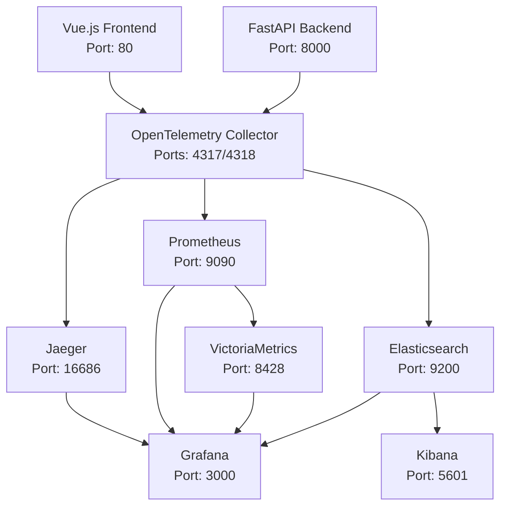

# Components Overview - API Observability Stack

This document provides a comprehensive overview of all components in the API HTTP Request Logging Management System.

## 🏗️ Architecture Overview



## 📦 Component Details

### 1. Frontend Application (Vue.js)
**📁 Location**: `frontend/`
**🐳 Container**: `frontend`
**🌐 Port**: `80`

#### Purpose
- Interactive web application for testing API endpoints
- OpenTelemetry Web SDK integration for browser-side tracing
- Automatic trace context propagation to backend

#### Key Features
- **Automatic HTTP instrumentation**: All fetch/XHR requests traced
- **User interaction tracking**: Button clicks, form submissions
- **Error tracking**: Frontend errors captured in traces
- **W3C trace propagation**: traceparent headers injected
- **Structured logging**: Correlated with trace context

#### Files Structure
```
frontend/
├── src/
│   ├── App.vue           # Main application component
│   ├── main.js           # Entry point with OTel initialization
│   ├── telemetry.js      # OpenTelemetry configuration
│   └── router/           # Vue Router setup
├── Dockerfile            # Multi-stage build (Node.js + Nginx)
├── nginx.conf            # Production web server config
├── package.json          # Dependencies and scripts
├── vite.config.js        # Build configuration
└── index.html            # HTML template
```

#### Dependencies
- Vue.js 3.x
- OpenTelemetry Web SDK packages
- Vite build system
- Nginx for production serving

---

### 2. Backend API (FastAPI)
**📁 Location**: `backend/`
**🐳 Container**: `fastapi-backend`
**🌐 Port**: `8000`

#### Purpose
- RESTful API server with comprehensive observability
- Business logic processing with tracing
- Metrics exposure for Prometheus

#### Key Features
- **OpenTelemetry instrumentation**: Automatic and manual spans
- **Prometheus metrics**: Request rate, duration, errors, active requests
- **Trace-correlated logging**: All logs include trace_id and span_id
- **Security**: Sensitive headers automatically masked
- **Health endpoints**: `/health` and `/metrics`

#### Files Structure
```
backend/
├── app.py              # Main FastAPI application
├── requirements.txt    # Python dependencies
└── Dockerfile         # Python runtime container
```

#### API Endpoints
- `GET /` - Root endpoint
- `GET /health` - Health check
- `GET /metrics` - Prometheus metrics
- `GET /api/users` - List users
- `GET /api/users/{id}` - Get user by ID
- `POST /api/users` - Create user
- `GET /api/slow` - Slow operation simulation
- `GET /api/error` - Error simulation

#### Dependencies
- FastAPI framework
- OpenTelemetry Python SDK
- Prometheus client
- Uvicorn ASGI server

---

### 3. OpenTelemetry Collector
**📁 Location**: `otel/`
**🐳 Container**: `otel-collector`
**🌐 Ports**: `4317` (gRPC), `4318` (HTTP), `8888` (metrics)

#### Purpose
- Central telemetry data processing hub
- Protocol translation and data routing
- Performance optimization through batching

#### Key Features
- **Multi-protocol receivers**: OTLP gRPC/HTTP, Prometheus scraping
- **Data processing**: Batching, filtering, attribute manipulation
- **Multiple exporters**: Jaeger, Prometheus, Elasticsearch
- **Performance optimization**: Memory limits, sampling
- **Security**: Sensitive data filtering

#### Configuration Structure
```yaml
receivers:      # Data input sources
processors:     # Data transformation
exporters:      # Data output destinations
service:        # Pipeline definitions
```

#### Data Flow
1. **Receive**: Traces/logs from apps, metrics from Prometheus scraping
2. **Process**: Batch, filter, add attributes, remove sensitive data
3. **Export**: Route to appropriate storage backends

---

### 4. Jaeger (Distributed Tracing)
**📁 Location**: Docker image
**🐳 Container**: `jaeger`
**🌐 Port**: `16686` (UI), `14250` (gRPC)

#### Purpose
- Distributed tracing storage and visualization
- Trace search and analysis
- Service dependency mapping

#### Key Features
- **All-in-one deployment**: Storage, query, and UI
- **OTLP support**: Receives traces from collector
- **Web UI**: Interactive trace exploration
- **Service map**: Automatic service dependency discovery

#### Capabilities
- Trace search by service, operation, tags
- Trace timeline visualization
- Service performance analysis
- Error tracking and debugging

---

### 5. Prometheus (Metrics Collection)
**📁 Location**: `prometheus/`
**🐳 Container**: `prometheus`
**🌐 Port**: `9090`

#### Purpose
- Time-series metrics collection and storage
- Alerting rules evaluation
- Data source for Grafana dashboards

#### Key Features
- **Multi-target scraping**: OTel Collector, FastAPI, infrastructure
- **Query language**: PromQL for data analysis
- **Alerting**: Rule-based alerts (configurable)
- **Federation**: Data sharing with VictoriaMetrics

#### Configuration
```yaml
global:           # Global settings
scrape_configs:   # Target definitions
rule_files:       # Alert/recording rules
remote_write:     # Long-term storage
```

---

### 6. VictoriaMetrics (Long-term Metrics Storage)
**📁 Location**: Docker image
**🐳 Container**: `victoriametrics`
**🌐 Port**: `8428`

#### Purpose
- Long-term metrics storage
- High-performance time-series database
- Alternative to Prometheus for large-scale deployments

#### Key Features
- **Prometheus compatibility**: PromQL support
- **High compression**: Efficient storage
- **Remote write**: Receives data from Prometheus
- **Fast queries**: Optimized for large datasets

---

### 7. Elasticsearch (Log Storage)
**📁 Location**: Docker image
**🐳 Container**: `elasticsearch`
**🌐 Port**: `9200`

#### Purpose
- Distributed log storage and search
- Full-text search capabilities
- Structured log analysis

#### Key Features
- **Document storage**: JSON-based log entries
- **Full-text search**: Advanced query capabilities
- **Indexing**: Time-based log indices
- **RESTful API**: HTTP-based operations

#### Indices
- `otel-logs`: Application logs from collector
- `otel-traces`: Trace data (optional)

---

### 8. Kibana (Log Visualization)
**📁 Location**: Docker image
**🐳 Container**: `kibana`
**🌐 Port**: `5601`

#### Purpose
- Log exploration and visualization
- Dashboard creation for log analysis
- Data discovery and investigation

#### Key Features
- **Discover**: Real-time log exploration
- **Visualizations**: Charts, graphs, tables
- **Dashboards**: Custom log analytics
- **Dev Tools**: Direct Elasticsearch queries

---

### 9. Grafana (Unified Dashboards)
**📁 Location**: `grafana/`
**🐳 Container**: `grafana`
**🌐 Port**: `3000`

#### Purpose
- Unified observability visualization
- Multi-datasource dashboards
- Alerting and notification

#### Key Features
- **Multi-datasource**: Prometheus, Jaeger, Elasticsearch
- **Pre-built dashboards**: API observability focused
- **Interactive exploration**: Click-through to traces
- **Alerting**: Threshold-based notifications

#### Configuration Structure
```
grafana/
├── provisioning/
│   ├── datasources/     # Auto-configured data sources
│   └── dashboards/      # Dashboard provisioning
└── dashboards/          # JSON dashboard definitions
```

---

## 🔗 Data Flow Overview

### 1. Request Tracing Flow
```
User Action → Frontend (Vue.js) → HTTP Request with traceparent → 
Backend (FastAPI) → OpenTelemetry Spans → Collector → Jaeger
```

### 2. Metrics Collection Flow
```
FastAPI /metrics → Prometheus Scraping → VictoriaMetrics → 
Grafana Dashboards
```

### 3. Log Correlation Flow
```
Application Logs → Collector → Elasticsearch → Kibana/Grafana → 
Search by trace_id
```

## 🚦 Health Check Endpoints

| Service | Health Check URL | Expected Response |
|---------|------------------|-------------------|
| Frontend | `http://localhost/health` | `healthy` |
| Backend | `http://localhost:8000/health` | `{"status": "healthy"}` |
| Prometheus | `http://localhost:9090/-/ready` | `Prometheus is Ready.` |
| Elasticsearch | `http://localhost:9200/_cluster/health` | `{"status": "green/yellow"}` |
| Jaeger | `http://localhost:16686/` | HTML page |
| Grafana | `http://localhost:3000/api/health` | `{"status": "ok"}` |
| VictoriaMetrics | `http://localhost:8428/health` | `OK` |
| OTel Collector | `http://localhost:8888/metrics` | Prometheus metrics |

## 📊 Resource Requirements

### Minimum Requirements
- **CPU**: 4 cores
- **RAM**: 8 GB
- **Disk**: 20 GB
- **Network**: 1 Gbps

### Recommended Requirements
- **CPU**: 8 cores
- **RAM**: 16 GB
- **Disk**: 50 GB SSD
- **Network**: 10 Gbps

## 🔧 Port Mapping

| Port | Service | Protocol | Purpose |
|------|---------|----------|---------|
| 80 | Frontend | HTTP | Web application |
| 3000 | Grafana | HTTP | Dashboards |
| 4317 | OTel Collector | gRPC | OTLP receiver |
| 4318 | OTel Collector | HTTP | OTLP receiver |
| 5601 | Kibana | HTTP | Log visualization |
| 8000 | FastAPI | HTTP | API server |
| 8428 | VictoriaMetrics | HTTP | Metrics storage |
| 8888 | OTel Collector | HTTP | Metrics endpoint |
| 9090 | Prometheus | HTTP | Metrics collection |
| 9200 | Elasticsearch | HTTP | Log storage |
| 16686 | Jaeger | HTTP | Trace visualization |

## 🔄 Service Dependencies

### Startup Order
1. **Elasticsearch** (required by Kibana and Collector)
2. **Prometheus** (required by Grafana)
3. **Jaeger** (required by Collector)
4. **VictoriaMetrics** (independent)
5. **OpenTelemetry Collector** (depends on all storage backends)
6. **FastAPI Backend** (depends on Collector)
7. **Frontend** (depends on Backend)
8. **Kibana** (depends on Elasticsearch)
9. **Grafana** (depends on data sources)

### Runtime Dependencies
- **Frontend** → **Backend** → **OTel Collector** → **Storage**
- **Grafana** → **All data sources**
- **Kibana** → **Elasticsearch**